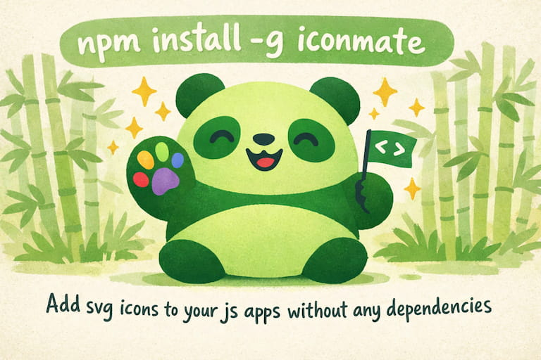

<p align="center">
  
</p>

<h1 align="center">iconmate</h1>

<p align="center"><strong>Add SVG icons to your JS apps without icon libraries.</strong></p>

<p align="center">
  
</p>

<p align="center">
  <a href="#quick-start">Quick Start</a>
  ·
  <a href="#installation">Install</a>
  ·
  <a href="#framework-presets">Presets</a>
  ·
  <a href="#command-line">CLI Commands</a>
  ·
  <a href="#configuration">Configuration</a>
</p>

Built from my blog post on [Why you might not need an icon library](https://carlotaleon.net/blog/why-you-dont-need-an-icon-library), `iconmate` is a Rust-powered CLI for developers who want the speed and control of plain files without icon-package bloat.

Use [icones.js.org](https://icones.js.org), a direct SVG URL, or raw SVG markup. `iconmate` drops the icon straight into your project and keeps your exports tidy.

## Why iconmate?

- **Zero dependencies** 📦: No icon library runtime added to your app
- **Framework-native output** 🧩: Generate files for React, Vue, Svelte, Solid, or plain SVG
- **Interactive by default** 🎮: Run `iconmate` and follow guided prompts
- **Multiple sources** 🌐: Pull icons from Iconify names, URLs, or raw SVG
- **Fast workflow** ⚡: Generate file + export line in one step
- **Prototype-friendly** 🏗️: Create empty SVG placeholders when needed

## Quick Start

```bash
# Install
npm install -g iconmate

# Run the TUI in your project 🚀
iconmate
```

✨ That's it. The interactive TUI guides you through adding icons to your project.

```tsx
// 👇 Then, you can just easily use any icon on your project like this!

import { IconHeart } from "@/assets/icons";

function MyApp() {
  return <IconHeart />;
}
```

## Configuration

You can also add sensible defaults by passing flags as configs:

```bash
iconmate --folder src/components/Icons/ --folder src/components/icons
iconmate --folder src/components/Icons/ --icon heroicons:heart --name Heart
```

Iconmate now includes config schemas + TS type definitions in the repo:

- Local config schema (repo): [`iconmatelocal.schema.json`](https://github.com/Blankeos/iconmate/blob/main/iconmatelocal.schema.json)
- Global config schema (repo): [`iconmateglobal.schema.json`](https://github.com/Blankeos/iconmate/blob/main/iconmateglobal.schema.json)
- Local config schema (raw): `https://raw.githubusercontent.com/Blankeos/iconmate/main/iconmatelocal.schema.json`
- Global config schema (raw): `https://raw.githubusercontent.com/Blankeos/iconmate/main/iconmateglobal.schema.json`
- Schema source: `config-gen/src/schema.ts`
- TS type definitions: `config-gen/src/types.ts`

Regenerate schemas from project root:

```bash
just config-schema
```

`just config-schema` installs `config-gen` deps and generates both schema files.

### Local Config (`iconmate.config.json`)

```json
{
  "$schema": "https://raw.githubusercontent.com/Blankeos/iconmate/main/iconmatelocal.schema.json",
  "folder": "src/assets/icons",
  "preset": "",
  "output_line_template": "export { default as Icon%name% } from './%icon%%ext%';",
  "svg_view_cmd": "zed %filename%"
}
```

Use the raw URL for `$schema` so editors can fetch JSON directly.

Local config keys:

- `folder` (default: `src/assets/icons`)
- `preset` (default: `""`, meaning plain `.svg` mode)
- `output_line_template` (default: `export { default as Icon%name% } from './%icon%%ext%';`)
- `svg_view_cmd` (supports `%filename%` token)

Allowed `preset` values:

- `""` (plain SVG mode)
- `react`
- `svelte`
- `solid`
- `vue`
- `emptysvg`

### Global Config (user-level)

Global config is for user-wide defaults and currently documents `svg_view_cmd`.

Suggested paths:

- macOS: `~/Library/Application Support/iconmate/config.json`
- Linux: `~/.config/iconmate/config.json`
- Windows: `%APPDATA%\\iconmate\\config.json`

Example global config:

```json
{
  "$schema": "https://raw.githubusercontent.com/Blankeos/iconmate/main/iconmatelocal.schema.json",
  "svg_view_cmd": "code %filename%"
}
```

> [!NOTE]
> This release adds config schemas and generated docs/types. Runtime loading/precedence wiring in the CLI/TUI is tracked in `folder-system-plan.md`.

## Installation

### NPM 🦖

```bash
npm install -g iconmate
# or
pnpm add -g iconmate
# or
bun add -g iconmate
```

For one-off usage:

```bash
npx iconmate
# or
pnpm dlx iconmate
# or
bunx iconmate
```

> [!NOTE]
> **Note for Bun users:** Bun doesn't run `postinstall` scripts [by default](https://bun.com/guides/install/trusted) which is needed to install the iconmate binary. Add `"trustedDependencies": ["iconmate"]` to your `package.json` to do it! But you're only limited to running it with a package.json.
>
> Recommended: Just use pnpx for quick one-off usage. If in a project, either install globally or configure trustDependencies.

### Install from Cargo 🦀

```bash
cargo install iconmate
```

Or clone and install from source:

```bash
git clone https://github.com/blankeos/iconmate.git
cd iconmate
cargo install --path .
```

## Framework Presets

Determines the output filetype and the contents inside that file type.

| Preset     | File Type | Framework         |
| ---------- | --------- | ----------------- |
| `normal`   | `.svg`    | Vanilla HTML/CSS  |
| `react`    | `.tsx`    | React Components  |
| `svelte`   | `.svelte` | Svelte Components |
| `solid`    | `.tsx`    | Solid Components  |
| `vue`      | `.vue`    | Vue Components    |
| `emptysvg` | `.svg`    | Placeholder       |

> [!IMPORTANT]
> If you want to use `.svg` file types, make sure to setup [svgr](https://github.com/gregberge/svgr). I covered how to do this in:
>
> - [SolidJS (Vite)](https://carlotaleon.net/blog/why-you-dont-need-an-icon-library#use-svg-only-with-solidjs)
> - [React (Vite)](https://carlotaleon.net/blog/why-you-dont-need-an-icon-library#use-svg-only-with-react-vite)
> - [React (NextJS)](https://carlotaleon.net/blog/why-you-dont-need-an-icon-library#use-svg-only-with-react-nextjs)
> - Vue - contribution welcome!
> - Svelte - couldn't find an svgr integration :(

## Command Line

### Interactive Mode (Recommended)

```bash
iconmate

# Description of each prompt:
> 📁 Folder (src/assets/icons/) # where your icons will be saved.

> ✨ Preset # i.e. How will it be saved? An `.svg` or `.tsx` file in react, solid, etc.

> 🚀 Icon # Source of your icon. i.e. 'heroicons:heart' from https://icones.js.org, full URL, or any SVG. Can be empty except for 'emptysvg' preset.

> 🌄 Filename # The filename without the extension. i.e. heroicons:heart. Will only be prompted if you used an SVG, or an URL on icon.

> 💎 Name # The "Heart" in <IconHeart />
```

### Add Specific Icon

```bash
iconmate add --folder src/assets/icons --icon heroicons:heart --name Heart
```

### With URL

```bash
iconmate add --folder src/assets/icons --icon https://api.iconify.design/mdi:heart.svg --name Heart
```

### Raw SVG Content

```bash
iconmate add --folder src/assets/icons --icon '<svg>...</svg>' --name Heart
```

### Custom Export Template

```bash
iconmate add --folder src/assets/icons --icon heroicons:heart --name Heart --output-line-template "export { ReactComponent as Icon%name% } from './%icon%.svg?react';"
```

### Delete icons

```bash
iconmate delete --folder src/assets/icons
```

### Iconify API Commands

```bash
# Search by keyword (text: one prefix:icon per line)
iconmate iconify search heart

# Search with pagination and JSON output
iconmate iconify search heart --limit 20 --start 0 --format json

# Include collection metadata in JSON search output
iconmate iconify search heart --format json --include-collections

# List all available collections
iconmate iconify collections

# List icons from one collection prefix
iconmate iconify collection mdi

# Get one icon as raw SVG (default)
iconmate iconify get mdi:heart

# Get one icon as raw Iconify JSON
iconmate iconify get mdi:heart --format json
```

`iconmate iconify get <prefix:icon> --format json` uses Iconify's JSON endpoint format,
for example `https://api.iconify.design/mdi.json?icons=heart`.

### Package.json Scripts

Best practice: Add sensible defaults to your script runner.

```jsonc
"scripts": {
  // Usage: npm run iconmate (usually this is the only command you need)!
  "iconmate": "iconmate --folder src/assets/icons/"
}
```

## Supported Platforms

- macOS (Intel & Apple Silicon) 🍎
- Linux (x64 & ARM64) 🐧
- Windows (x64) 🪟

## How It Works

1. **Find your icon**: Visit https://icones.js.org.
2. **Copy the name**: Like `heroicons:heart`.
3. **Run iconmate**: `iconmate`


## Why this structure?

1. **Copy-paste workflow**: Find icon on icones.js.org → copy name → paste into iconmate
2. **Organized by default**: Everything goes into `index.ts` exports automatically and just typing `<Icon` will autosuggest from your current collection. Just regular TS behavior.
3. **TypeScript ready**: Generated code is fully typed. Pass custom width, height, fills, you name it.
4. **Customizable** 🎨: Want to add a default Tailwind class on every icon? custom props? Just add it to the file!
5. **Git-friendly**: Plain SVG files, no binary assets
6. **Lightning fast**: Native Rust binary, no Node.js startup time

## Contributing

Contributions are welcome—pull requests for bug fixes, new framework presets, or improvements are appreciated.

🐱 Repo: [github.com/Blankeos/iconmate](https://github.com/Blankeos/iconmate) - Star it if you love it ⭐

## What's Completed from the Roadmap

- ✅ Interactive prompt mode
- ✅ Framework presets (React, Vue, Svelte, Solid)
- ✅ URL and raw SVG support
- ✅ Custom export templates
- ✅ Zero-config installation

### Original Future Plans

- [x] An empty command. Creates an .svg, adds it to the index.ts with a name you can specify.
- [x] Paste an actual svg instead of an icon `name`.
- [x] Just a `--preset=svg,react,solid,svelte,vue` - which basically overrides templates. Default is `svg`.
- [x] Prompt Mode via `iconmate` - Interactive mode so you won't need to pass arguments.
- [x] Delete an icon using `iconmate delete`
- [ ] Other frameworks i.e. --preset=flutter or Go/Rust GUI apps? (Not sure how they work yet though).
- [ ] ~Zed or VSCode Extension~ (seems unnecessary now, it's just a CLI)

---

Made with Rust 🦀 | Based on [my blog post][my_blog]

[my_blog]: https://carlotaleon.net/blog/why-you-dont-need-an-icon-library
[my_blog#svgr]: https://carlotaleon.net/blog/why-you-dont-need-an-icon-library#bonus-just-save-them-as-svg-files
